# 📚 Spring E-Learning & CBT Platform

[](https://openjdk.org)
[](https://spring.io/projects/spring-boot)
[](https://react.dev)
[](https://tailwindcss.com)
[](https://www.postgresql.org)
[](https://redis.io)
[](https://github.com/mfarim/laravel-elearning)
[](LICENSE)

> 🇮🇩 [Baca dalam Bahasa Indonesia](README.id.md)
>
> 🐘 **Looking for the Laravel & Livewire edition?** A companion monolithic edition built with **Laravel 13, Livewire 3, and Laravel Reverb** is available at: [https://github.com/mfarim/laravel-elearning](https://github.com/mfarim/laravel-elearning)

A full-featured enterprise web-based **E-Learning** and **Computer Based Test (CBT)** platform for managing modern academic learning activities between **Admin**, **Teacher**, and **Student**. Built with a decoupled cloud-ready architecture: **Java 21 LTS, Spring Boot 3.4+, React 19, and Tailwind CSS v4**, featuring stateless JWT authentication with impersonation, Redis cache, WebSocket STOMP real-time candidate proctoring, and Apache POI Excel batch processing.

---

## ✨ Key Features

### 👨‍💼 Admin Panel
| Feature | Description |
|---------|-------------|
| **Dashboard** | Real-time statistics overview: teachers, students, classrooms, subjects, CBT metrics |
| **Teachers** | Full CRUD with automatic user account provisioning & NIP validation |
| **Students** | CRUD + classroom filtering + **📥 Excel Batch Import** (`.xlsx`) + Exam Cards Print |
| **Classrooms** | CRUD + homeroom teacher assignment + capacity & academic year management |
| **Subjects** | CRUD + subject code + credit units + assigned teacher mapping |
| **Announcements** | CRUD + multi-target broadcasting (All / Teacher / Student) + publish toggle |
| **Impersonation** | Instant one-click login as teacher or student for administrative debugging |
| **Security** | Spring Security 6 stateless JWT tokens, BCrypt hashing, and method-level `@PreAuthorize` |

### 👨‍🏫 Teacher Panel
| Feature | Description |
|---------|-------------|
| **Dashboard** | Teaching metrics, scheduled examinations, active assignments, and recent activity |
| **Learning Materials** | CRUD + multi-type content (Document, Video, Text, Link, Audio) + student view tracking |
| **Assignments** | CRUD + deadline dates + instructions + submission grading with feedback |
| **CBT Examinations** | CRUD + duration timer + passing grade (KKM) + randomize questions/options + retry toggles |
| **Question Builder** | Multiple Choice (A-E), True/False, Essay + points allocation + **📥 Excel Import** |
| **Live Telemetry Monitor** | Real-time WebSocket candidate status, question progress bar, and anti-cheat flag alerts |
| **Exam Hall Tickets** | Print ready-to-use official CBT student candidate cards with NIS barcodes |

### 👨‍🎓 Student Panel — Mobile-First Design
| Feature | Description |
|---------|-------------|
| **Home Dashboard** | Responsive mobile drawer, upcoming exams countdown, active assignments, announcements |
| **Learning Modules** | Browse, read, and download structured course materials per enrolled subject |
| **Assignment Hub** | View assignment instructions + file upload dropzone + feedback review |
| **CBT Exam Room** | Fullscreen examination runner with countdown timer, anti-cheat detection, and auto-submit |
| **Grades & GPA Summary** | Subject average breakdown, progress bars, and passing grade pass/fail status |

### 🖥️ CBT Exam System Workflow
```
Exam List → Confirmation & Instructions → Secure Exam Runner
                                           ├── ⏱️ Synchronized Timer (auto-submit on expiry)
                                           ├── 🔒 Anti-Cheat Proctoring (fullscreen & tab change alerts)
                                           ├── 📍 Color-Coded Question Palette (answered / remaining)
                                           ├── 💾 Instant Auto-Save (on every option selection)
                                           └── 📊 Real-Time Proctor Telemetry (WebSocket push to teacher)
```

---

## 📸 Screenshots

### 🔐 Login Page
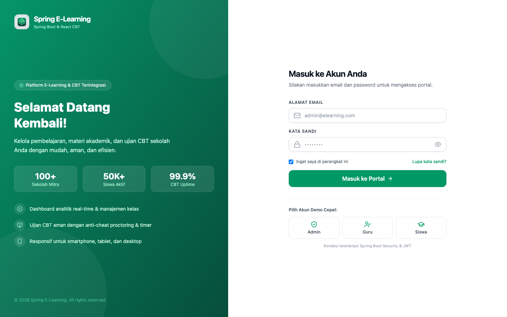

### 👨‍💼 Admin Panel

| Dashboard | Teachers Management |
|:---------:|:-------------------:|
| 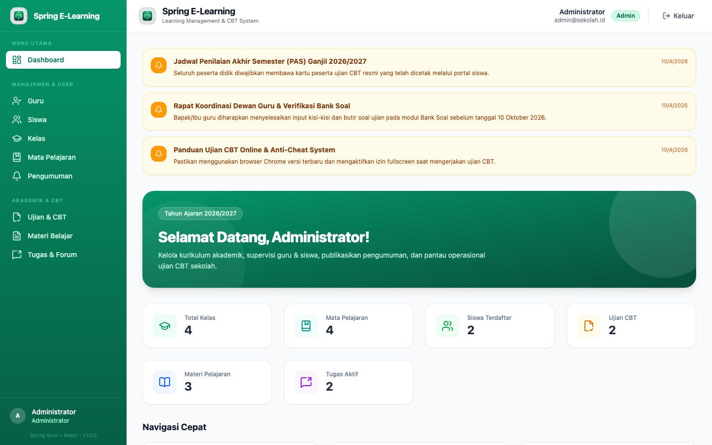 | 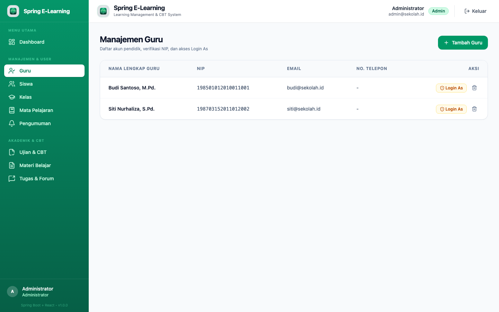 |

| Students Management | Classrooms Management |
|:-------------------:|:---------------------:|
| 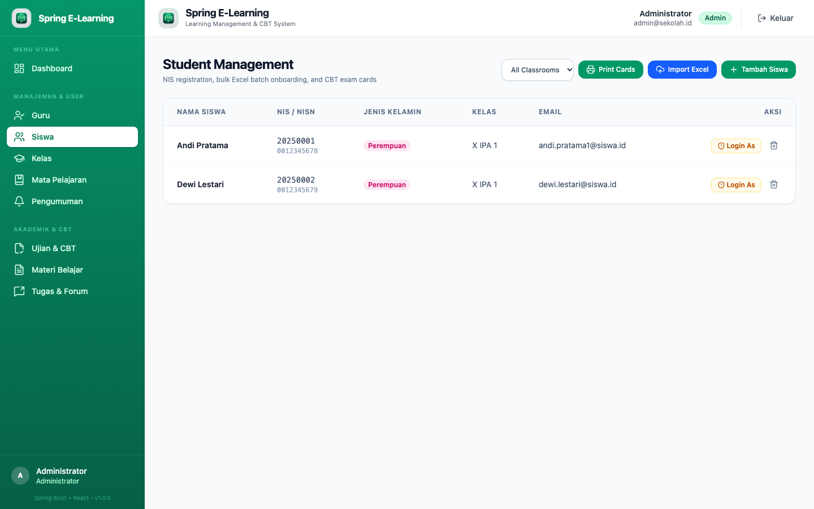 | 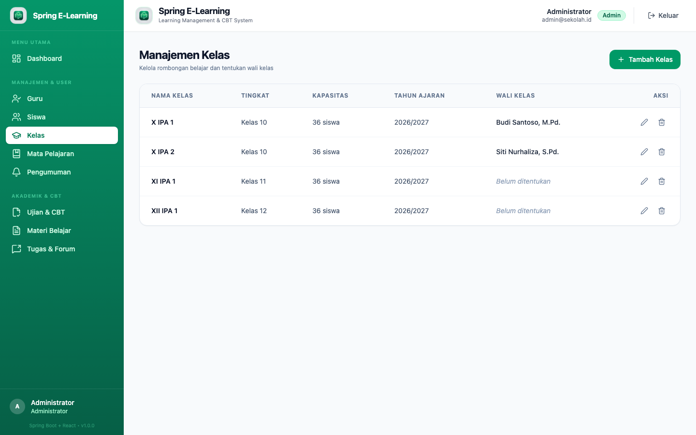 |

| Subjects Management | Announcements |
|:-------------------:|:-------------:|
| 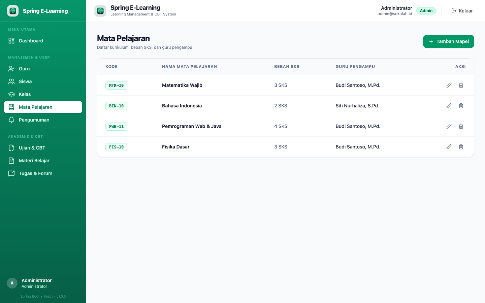 | 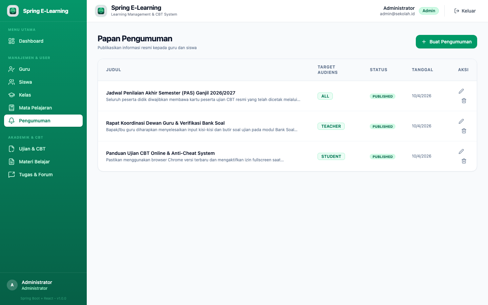 |

### 👨‍🏫 Teacher Panel

| Dashboard | Learning Materials |
|:---------:|:------------------:|
| 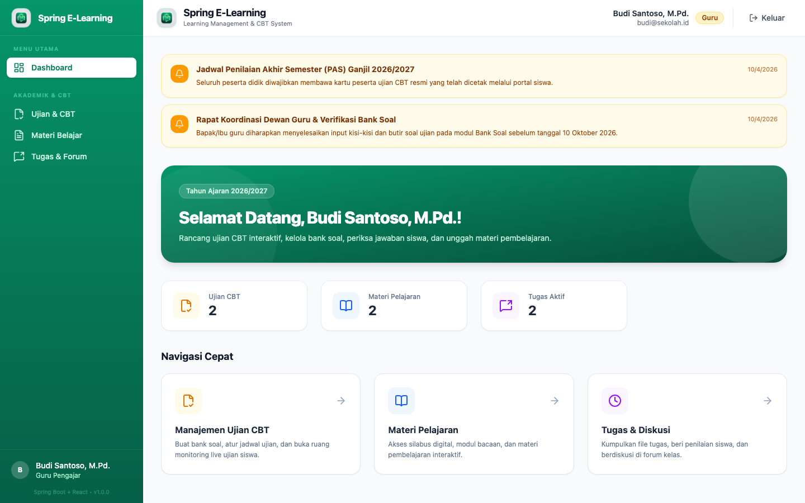 | 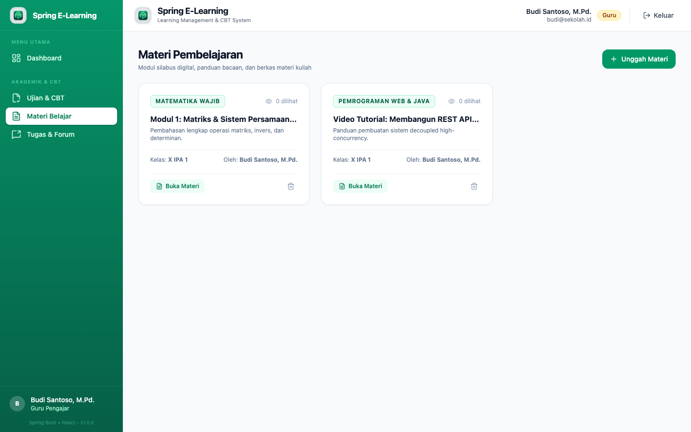 |

| Assignments Management | CBT Examinations |
|:----------------------:|:----------------:|
| 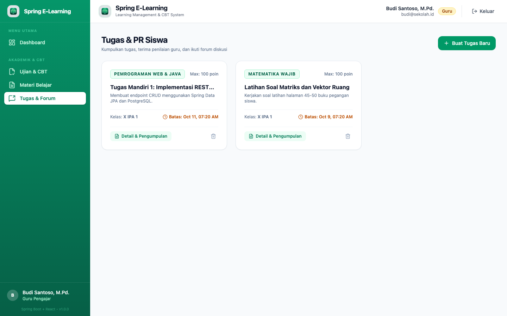 | 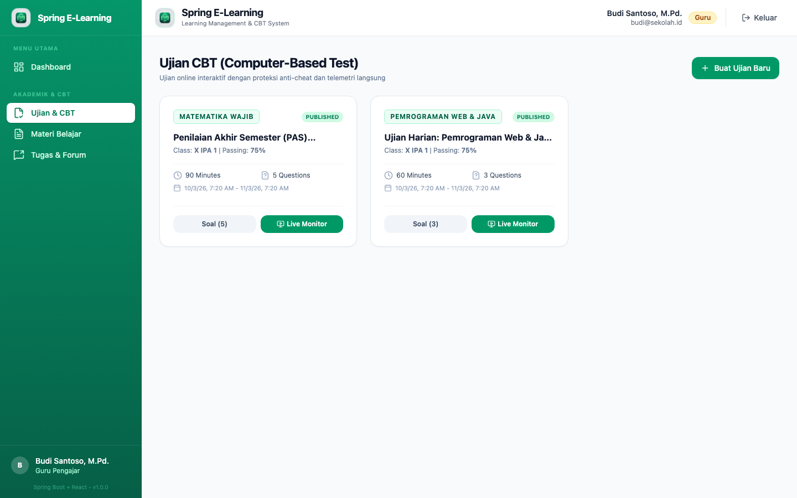 |

| Question Builder & Bank |
|:-----------------------:|
|  |

### 👨‍🎓 Student Panel (Mobile-First Design)

| Home Dashboard | Learning Materials | Assignments Hub |
|:--------------:|:------------------:|:---------------:|
| 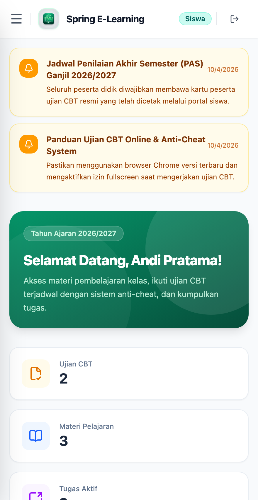 | 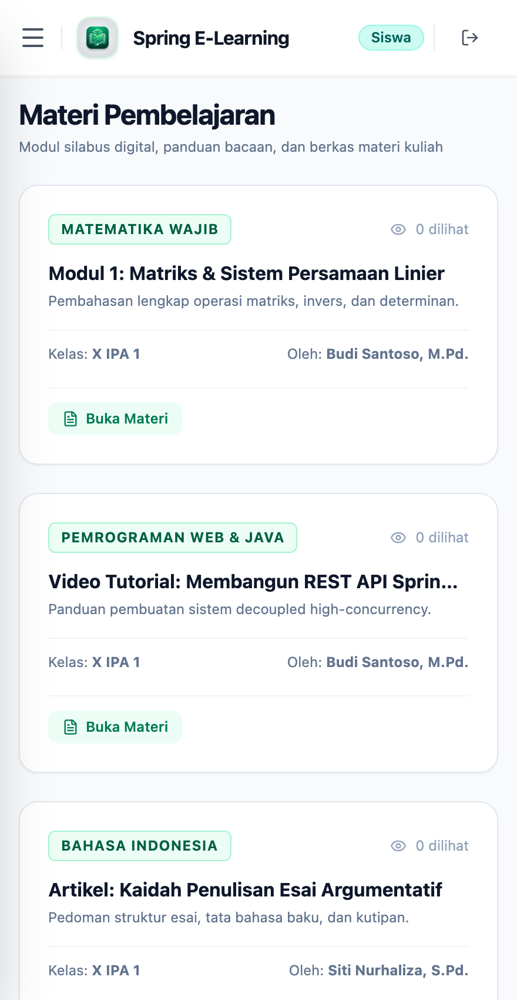 | 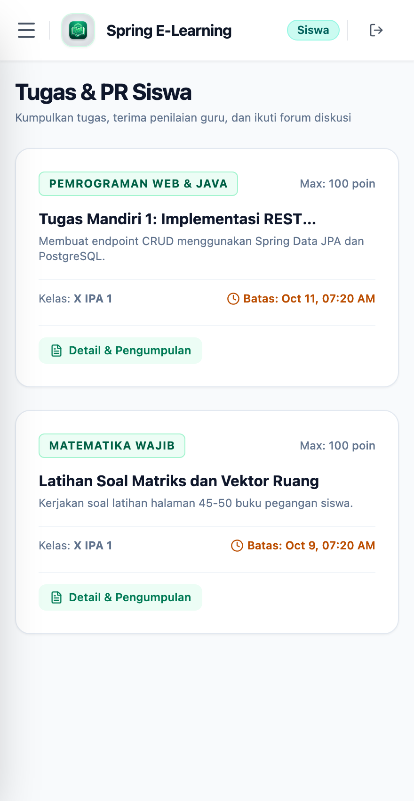 |

| Examination Room | Grades & Report Card |
|:----------------:|:--------------------:|
| 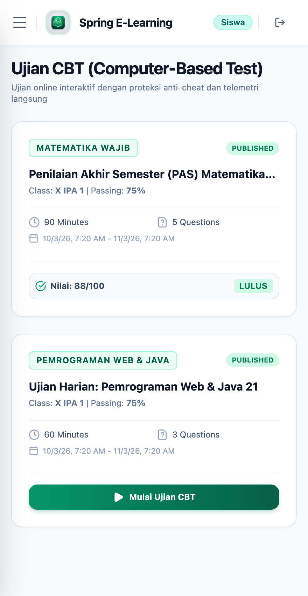 | 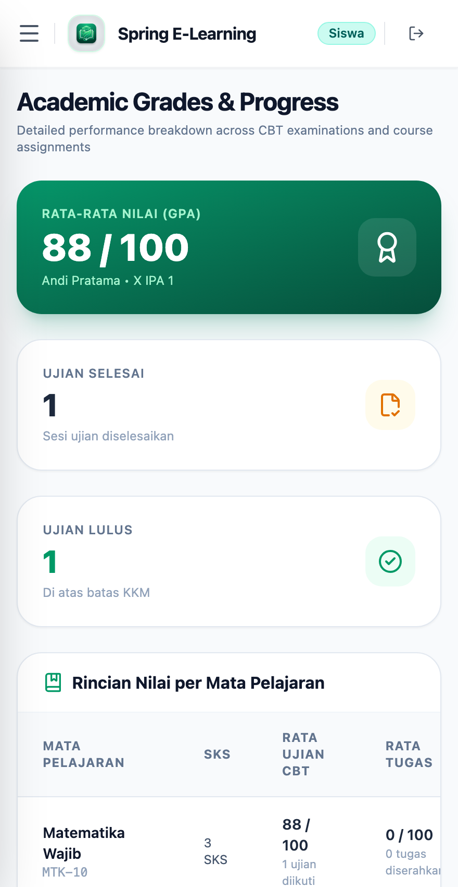 |

---

## 🛠️ Tech Stack

| Layer | Technology |
|-------|------------|
| **Backend Core** | Java 21 LTS, Spring Boot 3.4.3 |
| **Security & Auth** | Spring Security 6, JJWT 0.12.6, Method Security (`@PreAuthorize`), Impersonation Engine |
| **Persistence** | PostgreSQL 16, Spring Data JPA, Hibernate 6, HikariCP, Flyway Migrations |
| **Cache & Realtime** | Redis 7, Spring WebSocket + STOMP Message Broker, SockJS |
| **Batch Processing** | Apache POI (Excel `.xlsx` batch parsing for Students & Question Banks) |
| **API Documentation** | Springdoc OpenAPI 3 / Swagger UI (`/swagger-ui/index.html`) |
| **Frontend Core** | React 19, TypeScript 5+, Vite 6 |
| **Styling** | Tailwind CSS v4 (Native CSS engine with `@tailwindcss/vite`) |
| **State Management** | Zustand 5, Axios with JWT interceptors |
| **Icons & UI** | Lucide React |
| **Deployment** | Docker Compose, Multi-stage Dockerfiles (OpenJDK 21 Alpine & Node 20 Alpine) |

---

## 🏗️ Real-Time Telemetry & WebSocket Architecture

The live examination monitoring feature uses **Spring WebSocket with STOMP message broker** backed by Redis to monitor candidate progress in real time.

### Message Flow

```
┌─────────────────┐       ┌──────────────────────┐       ┌─────────────────────┐       ┌──────────────────┐
│  Candidate in   │──────▶│   Spring Controller  │──────▶│   Redis Cache /     │       │                  │
│  Exam Runner    │       │  /api/v1/exams/...   │       │   PostgreSQL DB     │       │   Spring STOMP   │
└─────────────────┘       └──────────┬───────────┘       └─────────────────────┘       │  Message Broker  │
                                     │                                                 │  (/ws/cbt)       │
                                     │  messagingTemplate.convertAndSend()             │                  │
                                     └────────────────────────────────────────────────▶│                  │
                                                                                       └────────┬─────────┘
                                                                                                │
                                                                       Real-time Telemetry Push │
                                                                                                ▼
                                                                                   ┌────────────────────────┐
                                                                                   │  Teacher Proctoring    │
                                                                                   │  Monitor Dashboard     │
                                                                                   │  → Instant auto-update │
                                                                                   └────────────────────────┘
```

### Key Components

| File / Component | Purpose |
|------------------|---------|
| `backend/.../WebSocketConfig.java` | Configures STOMP endpoints (`/ws/cbt`) and message broker destinations (`/topic`, `/app`) |
| `backend/.../ExamTelemetryMessage.java` | DTO representing real-time candidate heartbeat, progress, and anti-cheat violations |
| `backend/.../ExamService.java` | Broadcasts telemetry updates upon student answers, time alerts, and submission events |
| `frontend/src/pages/exams/ExamMonitor.tsx` | Proctoring dashboard with STOMP/SockJS client listener and candidate progress cards |
| `frontend/src/pages/exams/ExamRunner.tsx` | Secure candidate runner detecting window blur, tab switching, and fullscreen lock |

---

## 🚀 Installation & Quick Setup

### Prerequisites
- Docker & Docker Compose
- Java 21 LTS (for local backend development)
- Node.js 20+ (for local frontend development)

### Quick Setup (Docker Compose — Recommended)

```bash
# Clone the repository
git clone https://github.com/mfarim/spring-elearning-react.git
cd spring-elearning-react

# Launch full stack (PostgreSQL 16, Redis 7, Spring Boot backend, and React frontend)
docker compose up -d
```

Access the services:
- **Frontend Web Portal**: [http://localhost:3000](http://localhost:3000)
- **Spring Boot Backend API**: [http://localhost:8080](http://localhost:8080)
- **Interactive Swagger UI Documentation**: [http://localhost:8080/swagger-ui/index.html](http://localhost:8080/swagger-ui/index.html)

---

### Manual Setup (Local Development)

#### 1. Start Infrastructure
```bash
docker compose up -d postgres redis
```

#### 2. Start Backend (Spring Boot)
```bash
cd backend
./mvnw clean spring-boot:run
```

#### 3. Start Frontend (React + Vite)
```bash
cd frontend
npm install
npm run dev
```

---

## 🔑 Demo Accounts

The database comes pre-seeded with ready-to-test accounts for each academic role:

| Role | Email | Password | Portal URL |
|------|-------|----------|------------|
| **Admin** | `admin@sekolah.id` *(or admin@elearning.com)* | `password` | `/dashboard` |
| **Guru (Teacher)** | `budi@sekolah.id` *(or teacher@elearning.com)* | `password` | `/dashboard` |
| **Siswa (Student)** | `andi.pratama1@siswa.id` *(or student@elearning.com)* | `password` | `/dashboard` |

> *Quick Demo Login buttons are also available directly on the login screen for instant one-click access.*

---

## 📥 Student Excel Import Format

The student batch importer accepts standard `.xlsx` spreadsheets with the following columns:

| Column Header | Required | Example Value | Description |
|---------------|:--------:|---------------|-------------|
| **Name** | ✅ | Andi Pratama | Student's full registered name |
| **Email** | ✅ | andi@siswa.id | Unique login credential email |
| **NIS** | ✅ | 20250001 | Student identification number (unique barcode identifier) |
| **Classroom** | ✅ | X IPA 1 | Target classroom name |
| **NISN** | ➖ | 0012345678 | National student identification number |
| **Gender** | ➖ | L / P *(or M / F)* | Gender identification |
| **Address** | ➖ | Jl. Merdeka No. 45 | Residential home address |

---

## 🧪 Testing & Validation

### Backend Tests
```bash
cd backend
./mvnw test
```

### Frontend Build & Lint Check
```bash
cd frontend
npm run build
```

---

## 📂 Project Structure

```
java-spring-react-elearning/
├── backend/
│   ├── src/main/java/com/elearning/
│   │   ├── config/              # Security, JWT, WebSocket, Redis, Swagger configs
│   │   ├── common/              # Response wrappers, exceptions, pagination utilities
│   │   └── modules/
│   │       ├── academic/        # Classrooms, Subjects, Announcements
│   │       ├── user/            # Users, Teachers, Students, Impersonation
│   │       ├── learning/        # Learning Materials & Material Views
│   │       ├── assignment/      # Assignments, Submissions, Discussions
│   │       └── exam/            # CBT Exams, Question Bank, Telemetry, Attempts
│   └── src/main/resources/
│       ├── db/migration/        # Flyway SQL schema migrations & seeders
│       └── application.yml      # Spring Boot profile configurations
├── frontend/
│   ├── public/                  # Favicons, App Logo, OG Banner image
│   ├── src/
│   │   ├── api/                 # Axios HTTP client with JWT auto-refresh interceptors
│   │   ├── components/          # Common Layout, Sidebar, Top Navbar, ProtectedRoute
│   │   ├── pages/               # Admin, Teacher, Student, CBT Runner, Exam Monitor
│   │   ├── store/               # Zustand authentication & state management
│   │   └── types/               # TypeScript interfaces & DTO schemas
│   ├── index.html               # Semantic HTML with complete OpenGraph & JSON-LD SEO
│   └── vite.config.ts           # Vite 6 config with Tailwind CSS v4 native plugin
├── screenshots/                 # Application showcase captures across roles
└── docker-compose.yml           # Multi-container orchestration definition
```

---

## 🚢 Production Deployment

For production deployments:
1. Use the optimized multi-stage `backend/Dockerfile` and `frontend/Dockerfile`.
2. Configure external production PostgreSQL and Redis connection strings in environment variables (`SPRING_DATASOURCE_URL`, `SPRING_DATA_REDIS_HOST`).
3. Set a strong JWT secret (`JWT_SECRET`) with a minimum of 256 bits.
4. Deploy behind Nginx or Cloudflare with SSL/TLS termination and WebSocket header forwarding (`Upgrade` and `Connection` headers).

---

## 📄 License

This project is open-sourced software licensed under the [MIT license](LICENSE).
